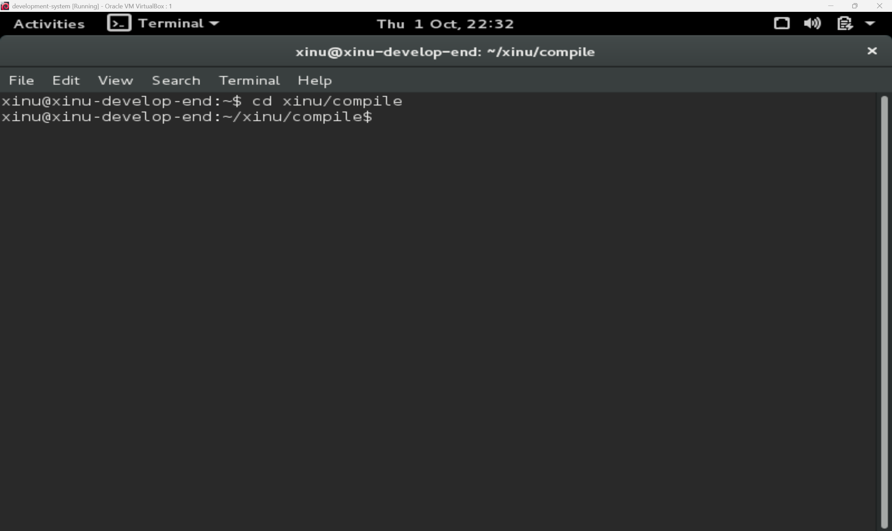
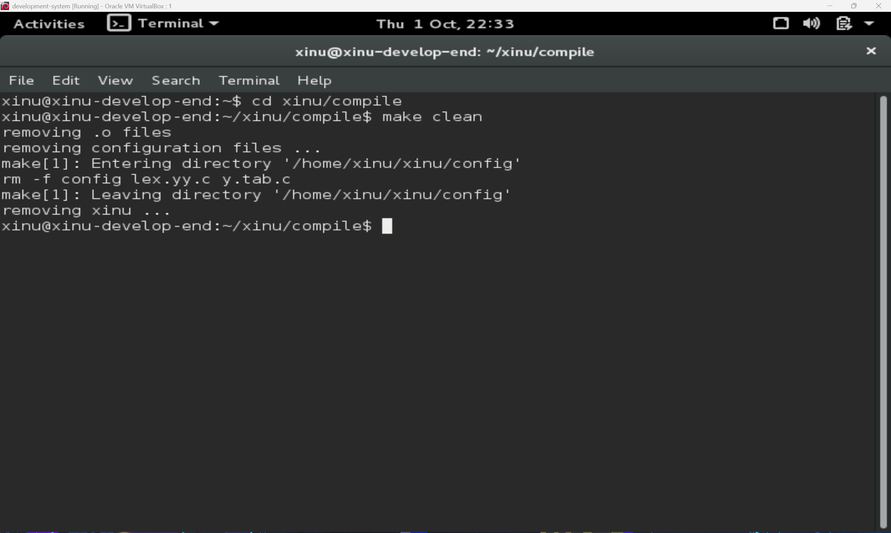
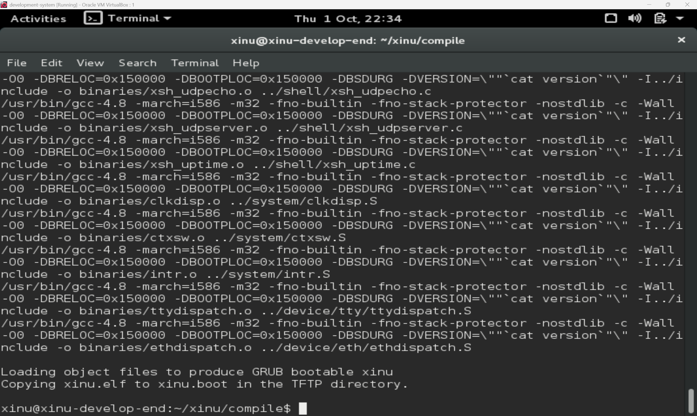
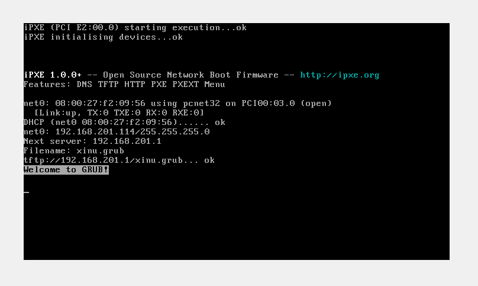
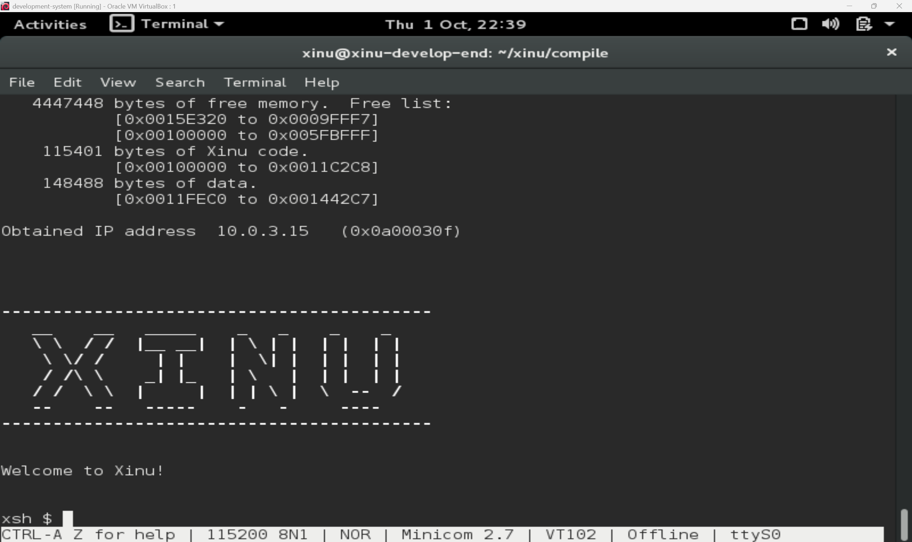
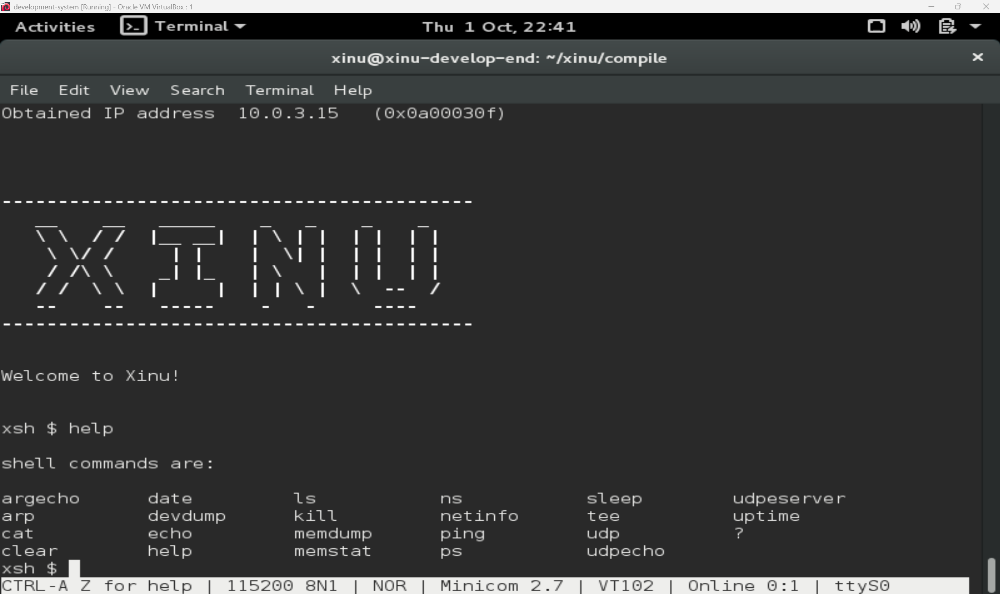

# Laporan Praktikum Sistem Operasi

## Modul 1, 2, dan 3: Instalasi, Arsitektur, dan Eksplorasi Xinu OS

### Identitas Praktikan

| Item | Keterangan |
|------|------------|
| **Nama** | I Made Diksatya Wilwadarma |
| **NIM** | 108072500069 |
| **Kelas** | IF-05-04 |
| **Asisten Praktikum** | Neuvalen & Galang |
| **Tanggal Praktikum** | 02 Oktober 2026 |

---

## 1. Tujuan Praktikum

1. Memahami ketentuan, tata tertib, dan persiapan *tools* yang digunakan pada praktikum Sistem Operasi, yaitu VirtualBox, Ubuntu, Xinu OS, dan Sourcetrail.
2. Memahami arsitektur *cross-development* pada sistem operasi *embedded* Xinu yang membagi lingkungan kerja menjadi *Development-System VM* dan *Backend VM*.
3. Mampu mengompilasi *source code* Xinu dan menjalankan hasilnya pada *target machine* melalui jaringan menggunakan PXE dan TFTP.
4. Mampu mengakses serta mencoba perintah dasar *shell* Xinu melalui koneksi *serial port* dengan Minicom.

---

## 2. Dasar Teori & Arsitektur Sistem

Xinu OS merupakan sistem operasi berukuran kecil yang ditujukan untuk lingkungan *embedded*. Pengembangannya menerapkan pendekatan **cross-development**, yaitu penggunaan komputer pengembangan (*development-system*) untuk menulis dan mengompilasi kode. Hasil kompilasi berupa *image* sistem operasi kemudian dipindahkan ke komputer target (*backend*) untuk dijalankan.

Arsitektur yang digunakan dalam praktikum ini terdiri dari dua *Virtual Machine* (VM):

1. **Development-System VM:** Menjalankan Debian Linux dan menyediakan *source code* Xinu, *compiler*, DHCP Server, serta TFTP Server.
2. **Backend VM:** Berperan sebagai komputer target yang melakukan *booting* melalui jaringan (PXE), mengambil *image* dari TFTP Server, kemudian menjalankan Xinu OS.

Kedua VM juga dihubungkan melalui *Virtual Serial Port*. Koneksi ini memungkinkan praktikan mengirimkan perintah dan melihat keluaran Xinu melalui terminal pada Development-System VM.

---

## 3. Langkah Kerja dan Hasil Eksplorasi

### 3.1 Login dan Kompilasi Source Code Xinu

Praktikum diawali dengan menjalankan **Development-System VM** melalui Oracle VM VirtualBox 6.1 pada Windows. Setelah VM menyala, praktikan melakukan *login* ke sistem operasi Debian menggunakan akun berikut:

- **Username:** `xinu`
- **Password:** `xinurocks`

Setelah masuk ke terminal, praktikan berpindah dari direktori *home* ke direktori kompilasi Xinu dengan perintah:

```bash
$ cd xinu/compile
```

**Hasil:**
Direktori kerja berpindah ke `~/xinu/compile`. Folder ini digunakan untuk menjalankan proses kompilasi Xinu.



*Gambar 1: Perpindahan ke direktori kompilasi Xinu menggunakan perintah `cd xinu/compile` pada Development-System VM.*

Selanjutnya, hasil kompilasi sebelumnya dibersihkan agar proses *build* berikutnya menggunakan berkas sumber yang terbaru.

```bash
$ make clean
```

**Hasil:**
Perintah `make clean` membersihkan berkas hasil kompilasi sebelumnya tanpa menghapus *source code* Xinu.



*Gambar 2: Pembersihan hasil kompilasi sebelumnya menggunakan perintah `make clean` pada Development-System VM.*

Setelah proses pembersihan selesai, praktikan menjalankan kompilasi dengan perintah:

```bash
$ make
```

**Hasil:**
Perintah `make` membangun *image* Xinu bernama `xinu.elf` di dalam direktori `xinu/compile`. Hasil kompilasi juga disalin ke direktori TFTP sebagai `/srv/tftp/xinu.boot` agar dapat diambil oleh Backend VM saat melakukan *booting*.



*Gambar 3: Proses kompilasi source code Xinu menggunakan perintah `make` pada Development-System VM.*

### 3.2 Booting Backend VM via PXE

Setelah kompilasi selesai dan Minicom disiapkan sebagaimana dijelaskan pada bagian 3.3, **Backend VM** dijalankan. Backend memperoleh sistem operasi melalui jaringan dengan mekanisme *network booting*. Tahapannya adalah sebagai berikut:

1. Backend VM menjalankan PXE dan meminta alamat IP serta informasi berkas *boot* dari DHCP Server pada Development-System VM.
2. Backend VM mengambil *bootloader* melalui TFTP, kemudian menampilkan tulisan **Welcome to GRUB!**.
3. GRUB memuat *image* `xinu.boot` yang disediakan oleh TFTP Server.
4. Xinu dimuat ke memori dan mulai berjalan pada Backend VM. Keberhasilannya diperiksa melalui sambutan Xinu dan prompt `xsh$` di Minicom.



*Gambar 4: Tampilan Backend VM saat melakukan booting melalui jaringan (PXE) dan memuat GRUB.*

### 3.3 Koneksi Serial Port menggunakan Minicom

Komunikasi dengan Xinu pada Backend VM dilakukan melalui aplikasi `minicom` di **Development-System VM**. Minicom dibuka sebelum Backend VM dinyalakan agar keluaran saat Xinu mulai berjalan dapat langsung diamati. Perintah yang digunakan adalah:

```bash
$ sudo minicom
```

*(Password: `xinurocks`)*

Perintah dijalankan menggunakan `sudo` agar Minicom memiliki izin yang diperlukan untuk mengakses perangkat serial.

**Hasil:**
Setelah Backend VM menjalankan Xinu, terminal Minicom menampilkan sambutan **Welcome to Xinu!** dan prompt **`xsh$`**. Tampilan tersebut menunjukkan bahwa praktikan sudah dapat berinteraksi dengan *Xinu Shell* melalui koneksi serial.



*Gambar 5: Koneksi melalui Minicom yang menampilkan sambutan Xinu dan prompt `xsh$`.*

### 3.4 Eksplorasi Perintah Shell Xinu

Melalui prompt `xsh$`, praktikan dapat menjalankan perintah yang disediakan oleh *shell* Xinu. Daftar perintahnya tidak sepenuhnya sama dengan Linux. Untuk mengetahui perintah yang tersedia, praktikan menjalankan:

```text
xsh$ help
```



*Gambar 6: Hasil perintah `help` yang menampilkan daftar perintah bawaan pada shell Xinu.*

Eksplorasi dilanjutkan dengan perintah `ps` untuk melihat informasi proses. Hasilnya menampilkan PID, nama proses, status, prioritas, PID induk, serta informasi stack. Pada saat pengamatan, proses `ps` berstatus `curr`, sedangkan proses lain memiliki status seperti `ready`, `wait`, dan `recv`.

---

## 4. Pembahasan

Berdasarkan kegiatan praktikum, beberapa hal yang dapat dipahami mengenai arsitektur dan cara kerja Xinu OS adalah sebagai berikut:

1. **Pemisahan Host dan Target (Cross-Development):**
   Penggunaan dua VM menggambarkan pengembangan sistem *embedded*, di mana pembuatan dan kompilasi kode dilakukan pada mesin pengembangan. Development-System VM menghasilkan *image* Xinu, sedangkan Backend VM menerima dan menjalankan *image* tersebut sebagai mesin target.
2. **Mekanisme Network Booting (PXE & TFTP):**
   Backend VM memperoleh berkas untuk menjalankan Xinu melalui jaringan. DHCP Server memberikan alamat IP dan informasi *boot*, sedangkan TFTP Server menyediakan berkas yang diperlukan. Setelah *bootloader* memuat `xinu.boot` ke RAM, Backend VM mulai menjalankan Xinu.
3. **Peran Serial Port dan Minicom:**
   Interaksi dengan Xinu dilakukan melalui koneksi serial virtual. Minicom berfungsi sebagai *terminal emulator* yang meneruskan masukan dari Development-System VM ke konsol Xinu, sekaligus menampilkan keluaran yang dikirimkan Backend VM.
4. **Xinu Shell (`xsh$`):**
   Shell Xinu menerima masukan berupa teks, mengenali nama perintah, kemudian menjalankan fungsi yang sesuai. Perintah `help` menampilkan daftar perintah yang tersedia, sedangkan `ps` memperlihatkan informasi proses. Perbedaan status pada hasil `ps` menunjukkan bahwa proses yang tercatat tidak semuanya sedang menggunakan CPU pada saat yang sama.

---

## 5. Kesimpulan

1. Praktikan telah mempelajari ketentuan praktikum dan menyiapkan lingkungan *cross-development* Xinu menggunakan Oracle VM VirtualBox.
2. Lingkungan praktikum menggunakan dua VM dengan peran berbeda, yaitu **Development-System** sebagai tempat kompilasi serta penyedia layanan DHCP/TFTP, dan **Backend** sebagai target yang menjalankan Xinu.
3. Perintah `cd xinu/compile`, `make clean`, dan `make` digunakan secara berurutan untuk masuk ke direktori kompilasi, membersihkan hasil *build* sebelumnya, serta menghasilkan *image* Xinu yang dimuat oleh Backend VM melalui jaringan.
4. Praktikan berhasil mengakses *Xinu Shell* melalui Minicom dan mencoba perintah `help` serta `ps`. Kegiatan ini memberikan pemahaman awal untuk mempelajari *source code*, pengelolaan proses, dan *system call* pada modul berikutnya.
